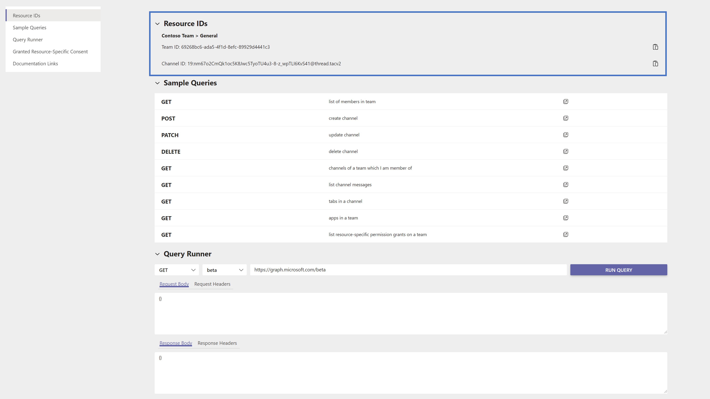
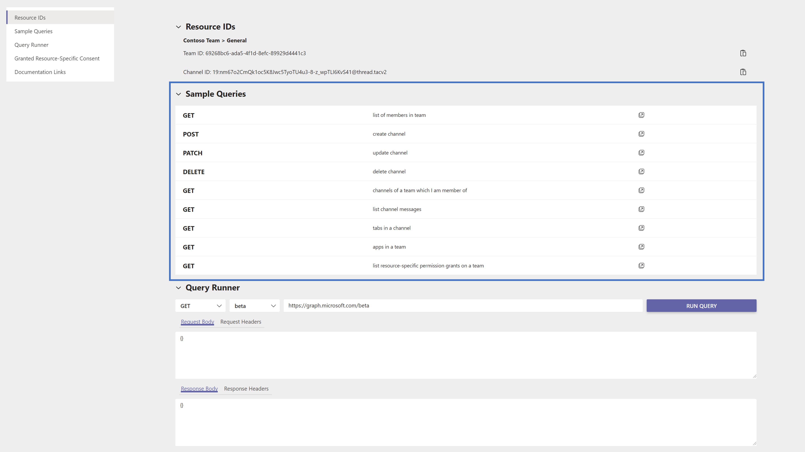
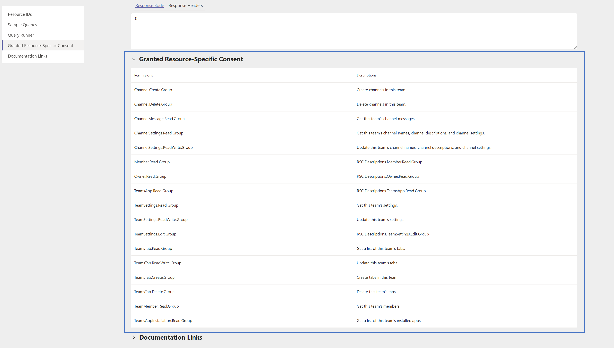

---

title: "Working with Graph Explorer Teams App"
description: "Find out how to use some of the important features in the Graph Explorer Teams app."
localization_priority: Normal
author: anneguo3

---

# Working with Graph Explorer Microsoft Teams App

The [Graph Explorer](#TODO) app in Microsoft Teams empowers you to conveniently make Microsoft Graph REST API requests and view corresponding responses.

## Resource IDs
To make Microsoft Graph REST API requests in a Teams instance, there must be an identified resource upon which the requests will query against. These permissions are known as resource-specific consent, and this **Resource IDs** section identifies the resource (chat or team channel) ths app is installed against, else it will note that there is no identified resource. 

## Sample Queries
Similar to the existing experience in the Graph Explorer web application, sample queries are given as a starting point for how Graph API requests can be used in a Teams environment.

## Query Runner
This query runner parallels the behavior of the existing Graph Explorer web application query runner, which includes the following elements:

1. HTTP verb drop-down list
2. API version drop-down list
3. Request query address bar

The response data shows up with:
1. HTTP response code
2. Response from Microsoft Graph API with data
3. Response headers

## Granted Resource-Specific Consent
The list of granted resource-specific consent allows you to understand what permissions have been granted to the app, and allows you to cross-reference with the permissions required for a request. To learn more about resource-specific consent, view the [documentation](https://aka.ms/teams-rsc).

